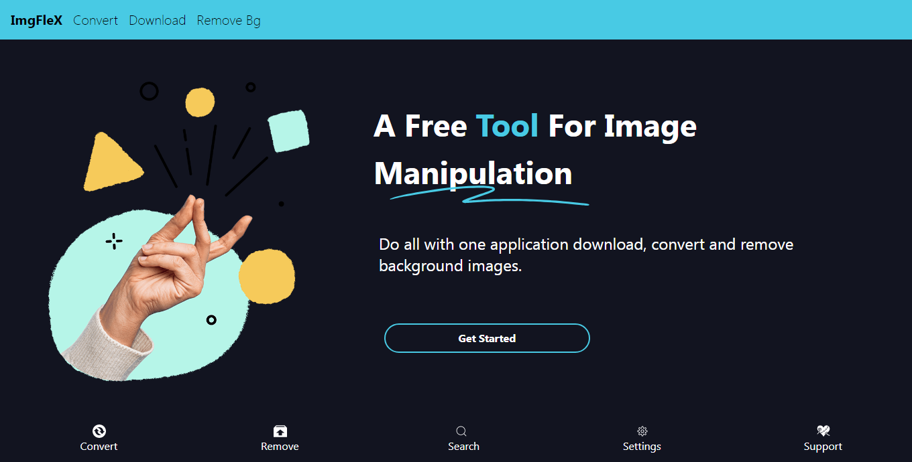
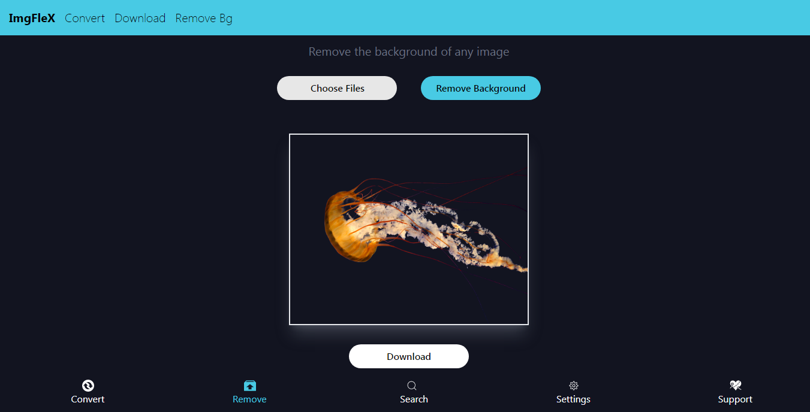
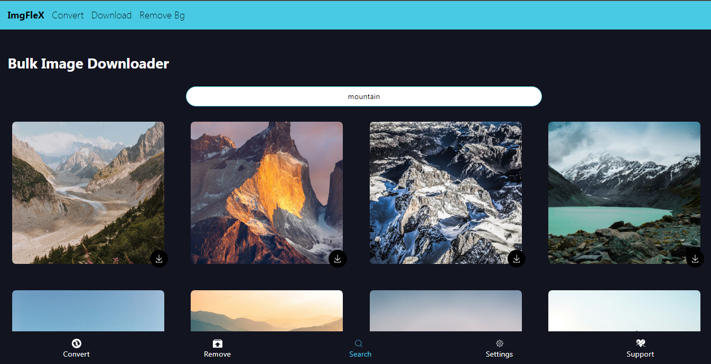

# [ImgFleX](https://664e4f91ab580a2c74859528--reactjsprojects.netlify.app/)

ImgFleX is a versatile image processing web application. With ImgFleX, you can:
- Convert your image files to various formats including WebP.
- Remove the background of any image to get a transparent background.
- Search for images and download them.
- Download multiple images at once.

## Image Attachments




## Table of Contents
- [Demo](#demo)
- [Features](#features)
- [Technologies Used](#technologies-used)
- [Getting Started](#getting-started)
  - [Installation](#installation)
  - [Usage](#usage)
- [API Integration](#api-integration)
- [Customization](#customization)
- [Contributing](#contributing)
- [Acknowledgments](#acknowledgments)

## Demo
### Check out the live demo of ImgFleX [here..](https://664e4f91ab580a2c74859528--reactjsprojects.netlify.app/app).

## Features
- **Image Conversion**: Convert any image file to various formats including WebP to save space and improve loading times.
- **Background Removal**: Remove the background from images to get a transparent background with a single click.
- **Image Search and Download**: Search for images from a vast library and download them in your preferred format.
- **Bulk Download**: Download multiple images at once.

## Technologies Used
- **Frontend**: ReactJS, Tailwind CSS
- **APIs**: Unsplash API for image search, additional APIs for image processing
- **Build Tool**: Vite.js

## Getting Started

### Installation
1. Download the project files from the repository.

2. Navigate to the project directory:
    ```sh
    cd imgflex
    ```

3. Install the dependencies:
    ```sh
    npm install
    ```

### Usage
1. Start the development server:
    ```sh
    npm run dev
    ```

2. Open your browser and navigate to `http://localhost:3000` to see the application in action.

## API Integration
1. **Unsplash API**: Used for searching and downloading images.
   - Sign up on [Unsplash](https://unsplash.com/developers) to get your API key.
   - Replace the placeholder API key in your project with your actual key.

2. **Other APIs**: Integrate other APIs for background removal and image format conversion as needed.

## Customization
1. **Styling**: Modify the styles using Tailwind CSS classes in the components as per your design requirements.

## Contributing
Contributions are welcome! Please follow these steps:
1. Fork the repository.
2. Create a new branch (`git checkout -b feature-branch`).
3. Make your changes.
4. Commit your changes (`git commit -m 'Add some feature'`).
5. Push to the branch (`git push origin feature-branch`).
6. Open a pull request.

## Acknowledgments
- Thanks to [Unsplash](https://unsplash.com) for providing the image search API.
- Inspiration and resources from various open-source projects.


<hr/>
# React + Vite

This template provides a minimal setup to get React working in Vite with HMR and some ESLint rules.

Currently, two official plugins are available:

- [@vitejs/plugin-react](https://github.com/vitejs/vite-plugin-react/blob/main/packages/plugin-react/README.md) uses [Babel](https://babeljs.io/) for Fast Refresh
- [@vitejs/plugin-react-swc](https://github.com/vitejs/vite-plugin-react-swc) uses [SWC](https://swc.rs/) for Fast Refresh
